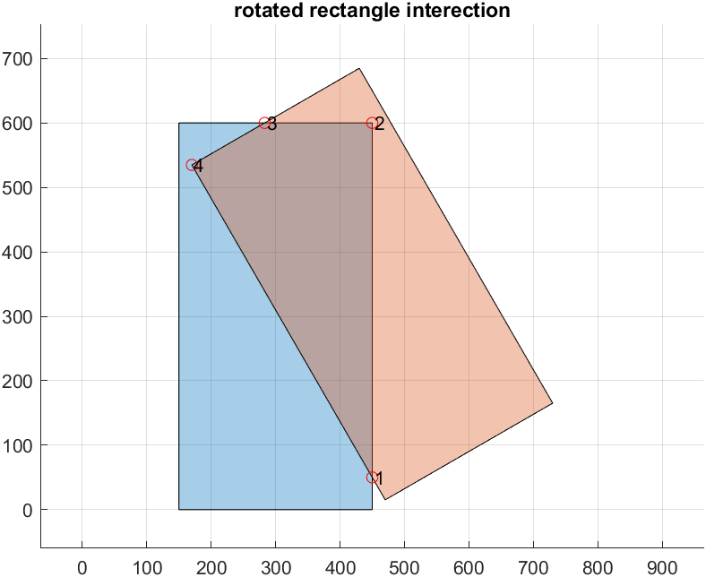

[](https://ww2.mathworks.cn/matlabcentral/fileexchange/119103-rotatedrectangleintersect)

# Intersection of rotated rectangles in the 2D plane

>In the field of 2D planar polygons in computational geometry, many basic applications use their geometric information calculations to a greater or lesser extent. For example, given a set of points you can create simple polygons and calculate basic geometric quantities such as area, for more complex polygon or geometric quantity calculations you can call on the relevant libraries/tools to implement them.Matlab since version R2017b has integrated the implementation of **generic polygons** for various basic operations, i.e. the user simply creates a polygon object. The object function can then be used to modify, query and visualise a polygon or set of polygons. While offering great convenience, the latest version does not currently support C/C++ code generation, such as the typical rotated rectangle to find the intersection, Matlab provides a built-in [`polyshape`](https://ww2.mathworks.cn/help/matlab/ref/polyshape.html) object function [`intersect`](https://ww2.mathworks.cn/help/matlab/ref/polyshape.intersect.html) to compute the intersection of any two polygons. This repository implementation aids in referencing the OpenCV source code and is only efficient for the typical **rotated rectangle** in everyday work, making up for the lack of support for C/C++ code generation in Matlab.

## Definition of the Rotated Rectangle pose in each coordinate system

The orientation of the rotation matrix in the image coordinate system, world coordinate system, is shown in the following figure.


$RotateRect=[centerX,centerY,width,height,yaw]$


The 2 diagrams above represent the pose orientation of the rotation matrix in the world and image coordinate systems respectively. **Red arrows** represent the orientation of this rotating rectangle and the $yaw$ angle is the angle of rotation around the centre of the rectangle $(x_0,y_0)$ in the positive direction of the $x$ axis to the direction of the red arrow, in accordance with the right-hand rule convention. In the world coordinate system, this is usually measured in metres, while in the image coordinate system, it is usually measured in pixels.

## Example

```matlab
%% Define two rotated Rectangles
% centre coordinates (300,300), (450,350), width and height [600,300], orientation 0, 30 degrees respectively
RotatedRect1 = [300,300,600,300,0];% [centerx,centery,width,height,yaw]
RotatedRect2 = [450,350,600,300,30];% [centerx,centery,width,height,yaw]
v1 = getVertices(RotatedRect1);% Get the 4 vertex order points of the first rectangle
v2 = getVertices(RotatedRect2);% Get the 4 vertex order points of the second rectangle
pgon1 = polyshape(v1); % Use matlab's built-in functions to create a rectangular object, just to facilitate the display of the drawing
pgon2 = polyshape(v2);

%% show original rectangles
% Shows the position of the 2 rotating rectangles with blue asterisks and green plus signs to show the order of the vertices respectively
figure;
plot(pgon1);
hold on;grid on;
plot(pgon2);
axis equal;
```


```matlab
%% show result
% Find the intersection of the rotated rectangles and show the order of the vertices of the intersection with red circles
[intersectPoints,flag] = rotatedRectangleIntersection(RotatedRect1,RotatedRect2);
plot(intersectPoints(:,1),intersectPoints(:,2),'ro');
text(intersectPoints(:,1)+3,intersectPoints(:,2),...
    string(1:size(intersectPoints,1)))
```


